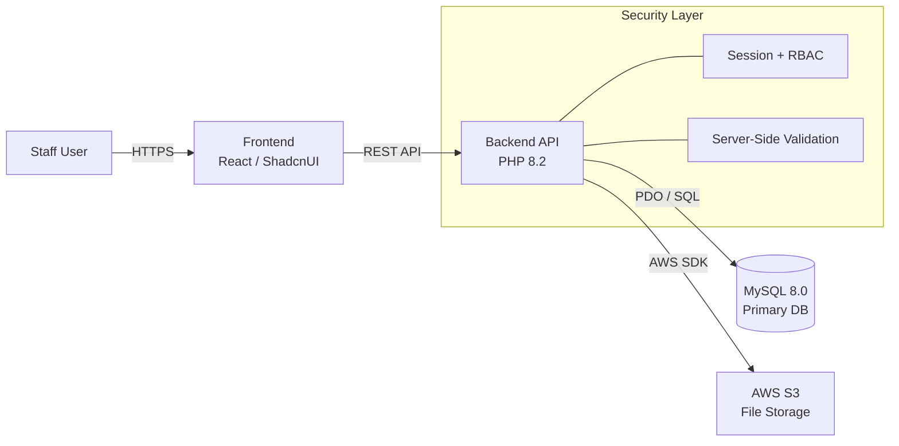

<div align="center">

# 🎓 Incident Report Module 
### Enterprise School Management Platform
**Production-grade system serving 30% of Ireland's education sector.**


<p align="center">
  
  
  
  
  
</p>

</div>

---

> [!IMPORTANT]
> **Proprietary Software Notice**
> This repository documents the **system architecture, database schema, and design decisions**. The source code is proprietary property of **Unique Schools App LLP**. This documentation demonstrates my expertise in full-stack development, system design, and production deployment.

---

## 📊 Project Overview
A production-grade incident management system built from scratch to digitize safety protocols for the Irish education sector. The system manages the complete lifecycle of student incidents, from reporting to resolution, with strict compliance, audit trails, and role-based access control.

### 🎯 Key Impact
* **Users:** 1000+ educational staff members daily.
* **Scale:** Handling thousands of student incident reports annually.
* **Performance:** Sub-second API response times under load.
* **Reliability:** 99.9% uptime since 2025 launch.

---

## 🏗️ High-Level Architecture



### 🛠 Technology Stack

| Layer | Technologies |
| --- | --- |
| **Frontend** | React.js, Tailwind CSS, Shadcn UI, Axios |
| **Backend** | PHP 8.2, RESTful Architecture, PDO (Security) |
| **Database** | MySQL 8.0, Normalized Schema, Composite Indexing |
| **Storage** | AWS S3 (Presigned URLs), Docker Containerization |
| **DevOps** | Docker Compose, Multi-stage builds, Git (Bitbucket) |

---

## 📐 Database Design (Schema)

The database uses a **normalized relational model** designed for data integrity and fast lookups.

```sql
/* Main Entity: Incident Reports */
CREATE TABLE incident_reports (
  id                  INT AUTO_INCREMENT PRIMARY KEY,
  school_id           INT NOT NULL, -- Indexed for Multi-tenancy
  student_id          INT NOT NULL,
  incident_type_id    INT NOT NULL,
  status              ENUM('Open', 'In Progress', 'Resolved') DEFAULT 'Open',
  description         TEXT,
  exclusion_period    VARCHAR(50),
  created_at          TIMESTAMP DEFAULT CURRENT_TIMESTAMP,
  assigned_to         INT,
  FOREIGN KEY (student_id) REFERENCES students(id)
);

/* Attachments Entity */
CREATE TABLE incident_attachments (
  id             INT AUTO_INCREMENT PRIMARY KEY,
  incident_id    INT NOT NULL,
  file_url       VARCHAR(255), -- S3 Object Key
  file_type      VARCHAR(50),
  uploaded_at    TIMESTAMP DEFAULT CURRENT_TIMESTAMP,
  FOREIGN KEY (incident_id) REFERENCES incident_reports(id)
);

```

---

## 🔌 API Architecture (RESTful)

The system exposes secure PHP endpoints following strict REST principles.

### Core Endpoints

| Method | Endpoint | Description |
| --- | --- | --- |
| `GET` | `/api/v1/incidents` | List incidents with **pagination & filters** |
| `POST` | `/api/v1/incidents/create` | Create new incident (Transactional) |
| `PATCH` | `/api/v1/incidents/status` | Update status (Triggers Audit Log) |
| `POST` | `/api/v1/files/sign-url` | Generate **S3 Presigned URL** |

---

## 🎨 Key Features Implemented

### 1. Incident Lifecycle Management

* Full CRUD operations with optimistic UI updates.
* **Exclusion Logic:** Auto-calculation of student exclusion periods (Days/Weeks).
* **Audit Trail:** Every status change is logged with a timestamp and reason.

### 2. Secure File Management (S3)

* Direct-to-S3 uploads using **Presigned URLs** (reduces server load).
* Strict validation for file types (PDF, Images) and size limits.
* Temporary download links with 1-hour expiration for security.

### 3. Advanced Filtering & Search

* **Dynamic Query Building:** Filter by Date Range, Campus, Year Group, or Staff.
* **Performance:** Server-side pagination handles datasets of 10,000+ records.

---

## 🔐 Security & Performance

* **Authentication:** Role-Based Access Control (RBAC) ensuring students cannot access admin logs.
* **Input Sanitization:** All inputs validated server-side to prevent XSS/SQL Injection.
* **Database Optimization:** Strategic use of **Composite Indexes** on `school_id` and `status` columns.
* **Architecture:** Stateless API design for horizontal scalability.

---

## 📈 Business Results

> "Reduced incident report processing time by **70%** and eliminated data entry errors by **95%**."

* ✅ **Scalability:** System handles 10x current load without degradation.
* ✅ **Compliance:** Fully compliant with Irish education data auditing standards.
* ✅ **Accessibility:** Fully responsive design allows staff to report from mobile devices.

---

<div align="center">

**Developed by Shivam Pawar**

</div>

```

```
